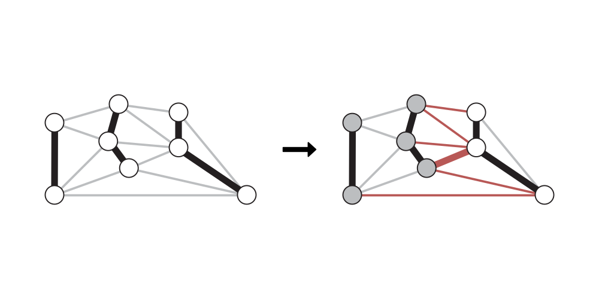

# Lecture 11 - Notes  

**February 15, 2016**  

## Minimum Weight Spanning Trees

_definition_: A __minimum weight spanning tree (MST)__ connects a graph using the lowest possible sum of edge weights.

### Greedy Algorithms

We make two assumptions,

1. The graph is connected
2. Edge weights are distinct (no two edges of the same weight)

The consequence is that the minimum weight spanning tree exists and is unique.

#### Cut Property

_definition_: If we __cut__ the graph along any number of edges the edge with the lowest weight will be in the MST.

#### Using the Cut Property

1. Cut the graph on a set of edges that aren't in the MST yet. 
2. Add the smallest edge to the MST. 
3. Repeat until we have $V - 1$ edges in the tree.

### Kruskal's Method

1. Go through the edges from smallest to largest
2. Add the edge as long as no cycle is created

### Prim's Method

1. Start with vertex 0 and grow the tree $T$
2. Stop when we have $V-1$ edges
